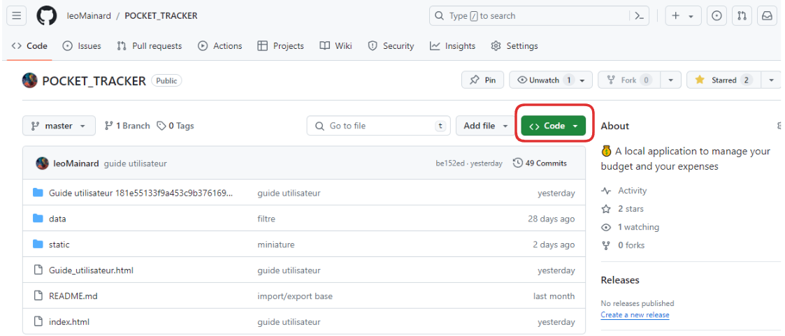

# POCKET TRACKER

Pocket Tracker est une application web conçue pour vous aider à gérer vos finances personnelles de manière intuitive et sécurisée. Elle vous permet de suivre vos opérations bancaires, de gérer vos comptes, de planifier votre budget, et de visualiser vos dépenses à travers différents graphiques et résumés.

.png)

.png)

---

## Installation

- Cliquez sur le bouton vert **`<> Code`**

- Cliquez ensuite sur `Download ZIP` . Un fichier .zip va se télécharger.

- Rendez-vous dans votre explorateur de fichier > Téléchargements et dézippez le dossier zip à l’endroit de votre choix.
- Ouvrez le dossier dézippé. Vous y trouverez les fichiers suivants :

- Pour lancer l’application, double cliquez sur le fichier `index.html`. L’application se lancera dans votre navigateur.

<aside>
💡 Vous pouvez mettre l’application en favoris dans votre navigateur pour la retrouver plus facilement.

</aside>

⚠️ Ne supprimez / déplacez aucun fichier contenu dans ce dossier zip.

ℹ️ Le dossier data contient une base de données fictive que vous pouvez importer dans l’application.

---

## Guide utilisateur

L’application contient un guide utilisateur accessible lors de la première utilisation ou bien en cliquant sur le bouton ℹ️ en haut à gauche de l’application.